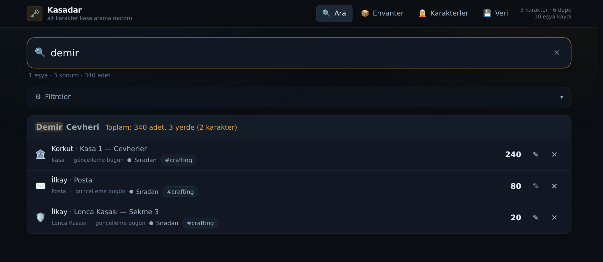
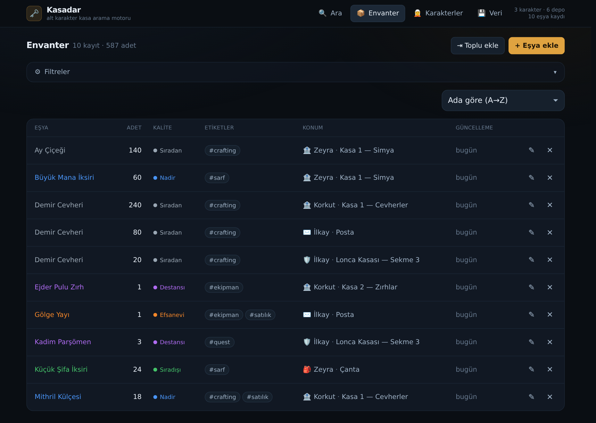
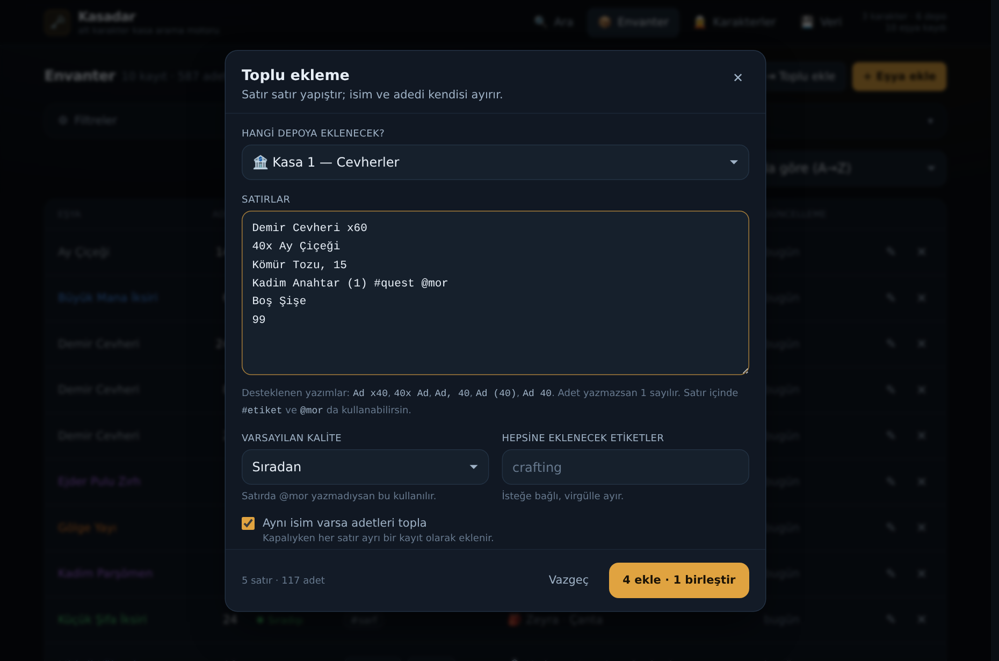
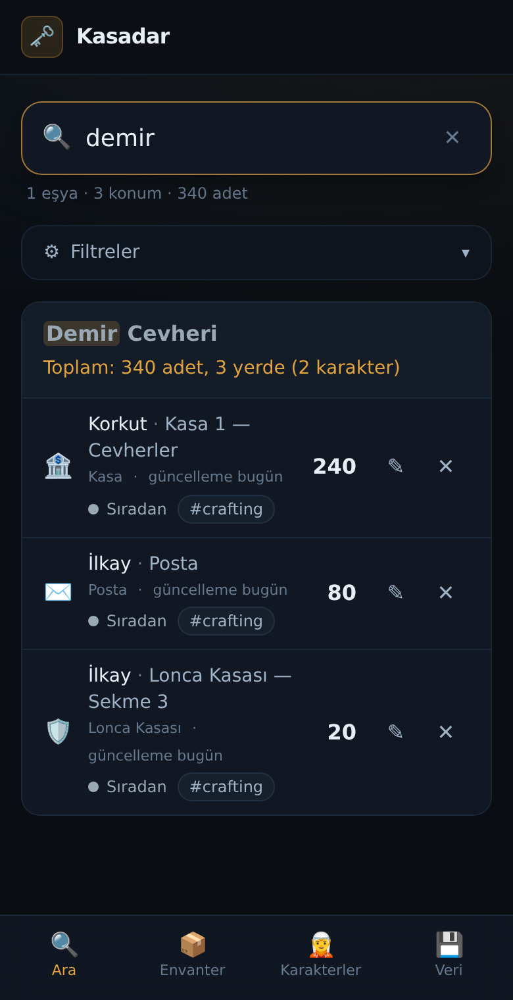

# 🗝️ Kasadar — Alt Karakter Kasa Arama Motoru

> **"O malzeme hangi karakterdeydi?"** — Kasadar bu soruya saniyeler içinde cevap verir.

MMORPG oynarken eşyalar birden fazla karakterin çantasına, kasa sekmelerine ve postasına
dağılır. Kasadar bu dağınıklığı tek bir aranabilir deftere çevirir.

**▶︎ Uygulamayı aç: <https://ardacck100-rgb.github.io/Kasadar/>**



- **Sunucu yok, hesap yok, internet gerekmiyor.** Veri yalnızca senin tarayıcında durur.
- **Kurulabilir uygulama (PWA).** Telefonda ve masaüstünde ana ekrana eklenir, çevrimdışı açılır.
- **Yazım hatasına ve Türkçe karakterlere dayanıklı arama.** "iksır" yazınca "İksir" bulunur.

---

## Kullanmaya başla

Kurulum gerekmiyor. Yukarıdaki adresi aç, kullanmaya başla.

Telefonda uygulama gibi çalışsın istersen: adresi aç → tarayıcı menüsünden
**"Ana ekrana ekle"** / **"Uygulamayı yükle"**. Artık tarayıcı çubuğu olmadan açılır ve
internet olmasa da çalışır.

İlk açılışta **Veri → Örnek veriyi yükle** ile uygulamayı dolu haliyle gezebilir, sonra
**Veri → Tüm veriyi sil** ile temizleyip kendi karakterlerini girebilirsin.

Sıra şöyle işler:

1. **Karakterler** sekmesinden karakterlerini ekle.
2. Her karaktere depolarını tanımla — çanta, kasa sekmeleri, posta, lonca kasası.
3. **Envanter** sekmesinden eşyaları gir. Oyundan kopyaladığın listeyi olduğu gibi
   yapıştırabilirsin (aşağıda).
4. Artık **Ara** sekmesi işini görüyor.

---

## Neler var

### Arama

Yazdıkça anlık sonuç. Türkçe karakterler normalize edilir (ı/i, ş/s, ğ/g, ü/u, ö/o, ç/c),
yazım hataları tolere edilir — `dmir cevherı` yazsan da *Demir Cevheri*'ni bulur. Eşya
adının yanı sıra etiket, karakter ve depo adı da aranır. Klavyeden `/` tuşu her yerden
arama kutusuna atlar.

Sonuçlar eşya adına göre gruplanır. Bir eşya birden çok yerdeyse başlıkta özet çıkar:

> **Demir Cevheri** — Toplam: 340 adet, 3 yerde (2 karakter)

### Envanter

Masaüstünde sütunlu tablo, mobilde dokunmatik dostu kart görünümü. Ada, adede,
güncellemeye ve konuma göre sıralanır. Eşya kalitesi renklerle ayrılır:
⚪ Sıradan · 🟢 Sıradışı · 🔵 Nadir · 🟣 Destansı · 🟠 Efsanevi



### Toplu ekleme

Tek tek form yerine, oyundan kopyaladığın satırları olduğu gibi yapıştır. Ayrıştırıcı
şu yazımların hepsini tanır:

```
Demir Cevheri x40      40x Demir Cevheri      Demir Cevheri, 40
Demir Cevheri ×40      Demir Cevheri (40)     Demir Cevheri 40
Demir Cevheri: 40      1.200 x Odun           Boş Şişe          → adet 1
Alev Tozu x12 #crafting @mor                  → satır içi etiket ve kalite
```

Yazdıkça önizleme gösterilir: hangi satır yeni kayıt olacak, hangisi mevcut kayda
eklenecek, hangisi okunamadı. "Aynı isim varsa adetleri topla" seçeneği varsayılan açıktır.



### Filtreler ve etiketler

Karakter, depo tipi, kalite ve etikete göre filtreleme. Aynı kategoride birden çok seçim
"veya", kategoriler arası "ve" demektir. Filtreler Ara ve Envanter ekranları arasında
ortaktır.

Eşyalara serbest etiket verilir (`crafting`, `quest`, `satılık`…). Nerede görürsen gör bir
etikete tıklamak arama ekranını o etiketle açar.

### Bayat veri uyarısı

Her depo son değiştirildiği tarihi tutar; depoyu ya da içindeki eşyaları değiştiren her
işlem bu tarihi tazeler. 30 günden eski depolar listelerde soluk gösterilir ve
**"güncellenmeli"** rozeti alır; üstte kaç deponun bayatladığını söyleyen bir şerit çıkar.
Depo satırındaki `↻` düğmesi "kontrol ettim, güncel" demek için.

### Yedekleme

Veri sekmesinden tüm veriyi tek JSON dosyası olarak indir, başka bir cihazda geri yükle.
Geri yükleme öncesi dosyada ne olduğunu (kaç karakter, kaç eşya) gösteren bir onay çıkar.

### Mobil



---

## Bilinen sınırlar

Bunlar bilinçli olarak yapılmadı, sürpriz olmasın diye yazıyorum:

- **Geri al (undo) yok.** Silme işlemleri onay ister ama geri alınamaz.
- **Veri cihaza bağlı.** Tarayıcı verisini temizlersen ya da başka cihaza geçersen kayıtlar
  gitmiş olur — arada bir yedek al. Cihazlar arası otomatik eşitleme yok.
- **Yedek geri yükleme birleştirmez, değiştirir.** İki cihazın verisini birleştirmek için
  ayrı bir mod gerekir.
- **Yeni sürüm bildirimi yok.** Uygulama güncellendiğinde bir sonraki açılışta kendiliğinden
  güncellenir, "yeni sürüm var" şeridi çıkmaz.

---

## Geliştirme

### Çalıştırma: iki komut

```bash
npm install
npm start
```

Terminalde `Local: http://localhost:5173/` yazısını görünce tarayıcıda o adresi aç.

Gereksinim: **Node.js 20.19+ veya 22.12+** ([nodejs.org](https://nodejs.org) → LTS).

Yayına hazır dosyaları üretmek için `npm run build` — çıktı `dist/` klasörüne düşer. Göreli
yollarla derlendiği için o klasörü herhangi bir statik sunucuya, hatta bir alt klasöre
olduğu gibi koyabilirsin.

Ayar dosyası neredeyse yok: Tailwind, Vite eklentisi üzerinden çalışıyor; `tailwind.config.js`
ya da `postcss.config.js` tutmuyoruz. Toplam yapılandırma tek dosya: `vite.config.js`.

### Yayın

`.github/workflows/deploy.yml` her push'ta uygulamayı derleyip GitHub Pages'e yayınlar.
Gereken tek seferlik ayar: **Settings → Pages → Source: "GitHub Actions"**.

> ⚠️ GitHub Pages yalnızca deponun **varsayılan dalından** yayın yapılmasına izin verir.
> Workflow şu an hem `main`'i hem de mevcut varsayılan dalı dinliyor. Varsayılan dal
> `main` yapıldığında `deploy.yml`'deki diğer dal satırı silinmelidir.

### Dosya yapısı

```
index.html                Uygulama kabuğu, manifest ve ikon bağlantıları
vite.config.js            Tek yapılandırma dosyası (React + Tailwind eklentileri)
.github/workflows/        GitHub Pages'e otomatik yayın
docs/ekran-goruntuleri/   README görselleri
public/
  manifest.webmanifest    PWA tanımı
  sw.js                   Service worker — çevrimdışı açılış
  icons/                  Uygulama ikonları (SVG kaynak + üretilmiş PNG'ler)
src/
  main.jsx                Giriş noktası; sağlayıcılar ve service worker kaydı
  App.jsx                 Görünüm yönlendirmesi ve "/" kısayolu
  index.css               Koyu tema, kalite renkleri, temel stiller
  lib/
    id.js                 Kimlik üretici
    date.js               Tarih biçimleme, "3 gün önce", bayatlık hesabı
    normalize.js          Türkçe normalizasyon (uzunluk korumalı)
    fuzzy.js              Yaklaşık eşleştirme, Levenshtein, puanlama
    parseBulk.js          Toplu yapıştırma ayrıştırıcısı
    download.js           JSON indirme / dosya okuma
    pwa.js                Service worker kaydı, kurulum istemi, çevrimiçi durumu
  data/
    schema.js             Veri modeli: sabitler, fabrikalar, normalizasyon
    storage.js            localStorage okuma/yazma, göç, yedek biçimi
    demo.js               Örnek veri
  search/
    searchItems.js        Filtreleme, puanlama, ada göre gruplama
  state/
    dbReducer.js          Tüm yazma işlemleri; art arda silme, tarih tazeleme
    DatabaseContext.jsx   Veri sağlayıcı + eylemler
    UiContext.jsx         Görünüm, arama metni, filtreler
    selectors.js          Türkçe sıralama, sayım, sözlükler
    bulk.js               Toplu eklemeyi planlama ve uygulama
  components/
    ui/                   Button, Fields, Modal, ConfirmDialog, EmptyState, Chips
    layout/AppShell.jsx   Üst bar + mobil alt gezinme
    search/               Arama kutusu ve sonuç grupları
    items/                Eşya formu, toplu ekleme, liste (tablo + kart)
    filters/FilterBar.jsx Karakter / depo tipi / kalite / etiket filtreleri
    characters/           Karakter listesi, detayı, formu
    storages/             Depo listesi ve formu
    data/DataView.jsx     Yedekleme, kurulum, tehlikeli işlemler
```

### Arama motoru nasıl çalışıyor

`normalize.js` uzunluk koruyan bir normalizasyon yapar: her karakter tam olarak bir
karaktere dönüşür. Böylece normalize edilmiş metinde bulunan eşleşmenin konumu ham metinde
de aynı yere denk gelir ve sonuçlarda vurgulama yapılabilir.

`fuzzy.js` kademeli puanlar: birebir > baştan eşleşme > kelime başı > içinde geçme > harf
sırası (subsequence) > Levenshtein toleransı. Çok kelimeli sorguda **her kelime** hedefte
karşılık bulmak zorundadır, böylece alakasız sonuçlar elenir. Eşya adı birincil, etiket ve
konum ikincil ağırlıkta aranır.

### Veri modeli

Uygulama tek bir JSON belgesi üzerinde çalışır. Bu belge aynı zamanda yedekleme biçimidir;
tarayıcıda `kasadar:db:v1` anahtarıyla saklanır.

```jsonc
{
  "schemaVersion": 1,
  "createdAt": "2026-01-01T00:00:00.000Z",
  "updatedAt": "2026-01-01T00:00:00.000Z",

  "characters": [
    { "id": "chr_…", "name": "Zeyra", "charClass": "Büyücü", "server": "Anadolu",
      "note": "", "createdAt": "…", "updatedAt": "…" }
  ],

  "storages": [
    { "id": "stg_…", "characterId": "chr_…",
      "type": "canta | kasa | posta | lonca_kasasi",
      "name": "Kasa 1 — Simya", "note": "", "createdAt": "…", "updatedAt": "…" }
  ],

  "items": [
    { "id": "itm_…", "storageId": "stg_…", "name": "Ay Çiçeği", "quantity": 140,
      "quality": "gri | yesil | mavi | mor | turuncu",
      "tags": ["crafting"], "note": "", "createdAt": "…", "updatedAt": "…" }
  ]
}
```

Kurallar:

- Bir karakter silinince depoları, bir depo silinince eşyaları da silinir.
- Bir depoyu ya da içeriğini değiştiren her işlem deponun `updatedAt` alanını tazeler;
  bayat veri uyarısı bu alana bakar.
- Dışarıdan gelen veri (`localStorage` ya da içe aktarılan dosya) `normalizeDatabase` ile
  süzülür: eksik alanlar tamamlanır, tanınmayan tip/kalite değerleri varsayılana çekilir,
  sahibi olmayan kayıtlar atılır, etiketler küçük harfe indirilip tekilleştirilir.
- Bozuk JSON silinmez; `kasadar:db:v1:bozuk:<zaman>` anahtarına taşınır.

---

Ekran görüntülerindeki eşya ve karakter adları örnek veridir; uygulama hiçbir oyuna ya da
eşya listesine bağlı değildir.
